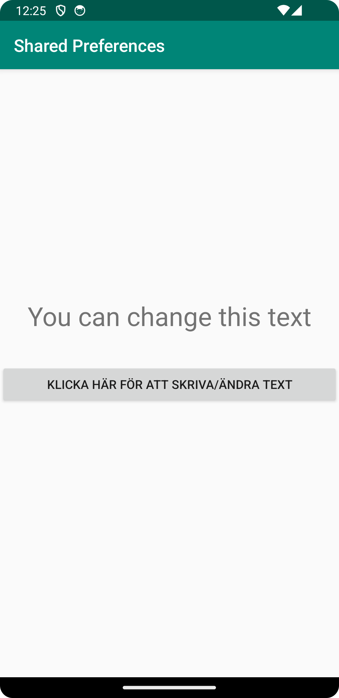
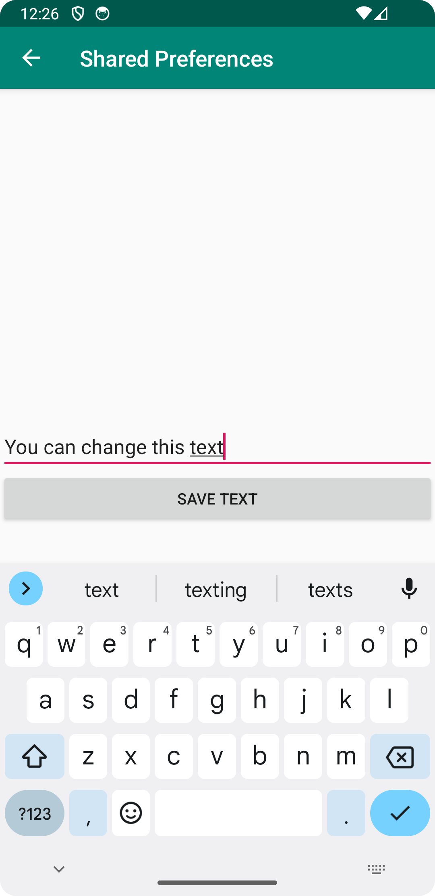

# Rapport

En ny activity skapas tillsammans med en layout fil som jag ger namnet SecondActivity.java samt activity_second.xml.
MainActivity sätts till att vara parent till SecondActivity:
`android:parentActivityName=".MainActivity"`

Detta underlättar så att man kan gå tillbaka till MainActivity via en bakåtpil.

en knapp skapas för att kunna navigera till SecondActivity
`private Button newScreenButton;
newScreenButton = findViewById(R.id.newScreenButton);`

Det görs genom att en ClickListener läggs till på knappen som skapar en ny screen (Intent) med SecondActivity

```
newScreenButton.setOnClickListener(new View.OnClickListener() {
    @Override
    public void onClick(View view) {
        Intent intent = new Intent(MainActivity.this, SecondActivity.class);
        startActivity(intent);
    }
}); 
```

För att kunna visa, ändra och redigera en text som ska visas i MainActivity så skapas instanser av
både SharedPreference och SharedPreference.Editor som jag namnger myPrefrenceRef respektive myPreferenceEditor
dessa görs även private. 
Dock är det endast en instans av SharedPreference som behövs i MainActivity eftersom
den endast ska visas i en TextView i MainActivity. Men i SecondActivity behövs bägge instanserna för att kunna
skriva och lagra de nya prefrenserna.

För att visa den inmatade texten i MainActivity så läggs en onResume metod till i MainActivity.
Denna metod säger att de nya preferenserna ska laddas in och visas i den TextView med namnet `prefTextRef`
när man går tillbaka från SecondActivity.
```
@Override
    public void onResume(){
        super.onResume();
        prefTextRef = findViewById(R.id.prefText);
        prefTextRef.setText(myPreferenceRef.getString("MyAppPreferenceString", "No preference found."));
    }
```

 
